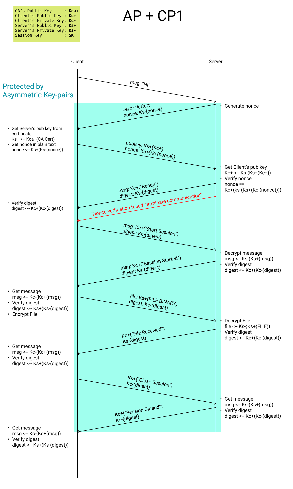
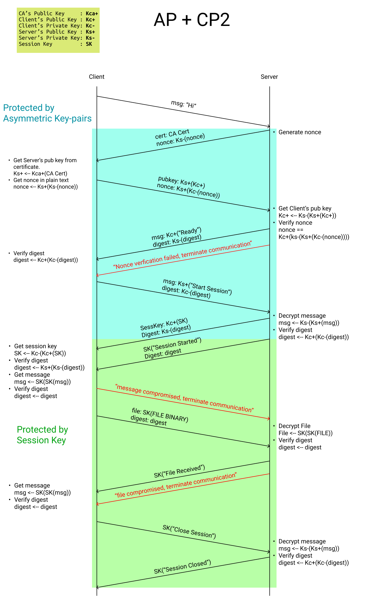

# ProgrammingAssignment2

Programming Assignment 2 for 50.005 Computer System Engineering at SUTD

-   [Daniel Low (1004372)](https://github.com/nexaitch)
-   [Huang He (1004561)](https://github.com/MarkHershey)

---

## Vulnerabilities in the original Authentication Protocol

-   The CA-signed certificate can assure the authenticity of the server, but, the server has no information about the client. So there is a lack of a client authentication process.
-   If we assume the server knows the client's identity through some password login process, (which is ignored in this project), the server is still exposed to replay attack, which means that any third party client could replay the client's request/ packet to exploit the server's indiscriminative request handling. **We will solve this issue by introducing the server-generated one-time verification number (NONCE). NONCE is generated and used only once per handshake, the client is expected to sign the NONCE and send it back to the server for verification, by doing this, the server is able to verify the client is live and authenticated.**
-   Since the server's certificate is public, and the nonce is still potentially at risk of leaking to a third party, if the client only uses the server's public key for encryption, any third party could potentially pretend to be the client and send files to the server. **We will solve this issue by letting both client and the server exchange their public key securely, and any follow-up communication not only need to be encrypted using the receiver's public key, but the digest also needs to be signed by using its own private key. (CP1)**

## Protocol

### CP1

### CP2

## Packet Type

| packetType (`int`) | Ref Name        | Payload Description              |
| :----------------: | :-------------- | :------------------------------- |
|        `0`         | `plainMsg`      | plain text message               |
|        `1`         | `encryptedMsg`  | encrypted text message           |
|        `2`         | `filename`      | encrypted filename               |
|        `3`         | `file`          | encrypted file content           |
|        `11`        | `sEncryptedMsg` | (session) encrypted text message |
|        `12`        | `sFilename`     | (session) encrypted filename     |
|        `13`        | `sFile`         | (session) encrypted file content |
|        `99`        | `cert`          | CA-signed certificate            |
|        `98`        | `nonce`         | nonce                            |
|        `97`        | `pubKey`        | public key                       |
|        `96`        | `sessionKey`    | encrypted session key            |

## Packet Schema

Use public key encryption

|        | packetType (`int`) | signed digest | payloadSize (`int`) |     Payload     |
| ------ | :----------------: | :-----------: | :-----------------: | :-------------: |
| length |      4 Bytes       |   128 Bytes   |       4 Bytes       | variable length |

Use session key encryption

|        | packetType (`int`) |  digest  | payloadSize (`int`) |     Payload     |
| ------ | :----------------: | :------: | :-----------------: | :-------------: |
| length |      4 Bytes       | 32 Bytes |       4 Bytes       | variable length |

## Performance statistics

-   TODO
